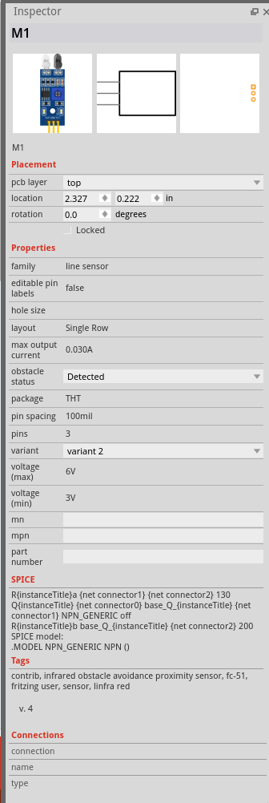

## Common errors the CI reports on parts and their fixes

### Missing viewBox attribute
This error will appear if the SVG has no viewBox attribute. If there is no viewBox, Fritzing will apply some heuristic to
guess the DPI and therefore the physical size of the graphic. This can easily go wrong.
*Fix*
Add all three, viewBox, width, and height attributes. Specify the width and height in mm or inch.

### Invisible connector
This error appears if a connector does not have renderable objects in the SVG. This often works, because Fritzing
modifies connector graphics by setting a color and a stroke. This is error prone: Sometimes, adding a stroke
is not enough, and some tools and SVG parsers remove non-visible elements. And since the element is not rendered by
regular SVG editors, there is also a risk to overlook misplaced connectors.
*Fix*
It depends. Often there is another visible element that represents the connector and should be used instead.
Sometimes this is a true error in the SVG, e.g. from mixed up connector IDs. Or, if you want to omit a connector entirely in a view,
you can mark it as 'hybrid' connector in the FZP file.

### Duplicate id attribute
IDs in SVGs must be unique; some programs can not deal with duplicates. This often happens in the PCB view, when
the same ID is used for connectors in different layers. In these cases Fritzing usually is able to refer the correct
element via the layer id. However, this is very easy to mess up, since it is also confusing during editing the part.
There is no verification that Fritzing does this as intended in each and every place.
*Fix*
Carefully check how the duplicate was introduced, maybe it is just numbered wrong. Or de-duplicate, by attaching
underscore and number. For the PCB view, you can also nest the copper0 group within the copper1 group, and use the
 same connector for both to have it in both layers.

### Invisible or missing terminal
This is one of the most common errors in Fritzing parts. If this error shows, Fritzing will use the center of the connector as 
terminal.
*Fix* 
Fritzing 1.0.3 will automatically set the terminal, unless a terminal explicitly specified in the FZP. Therefore, 
the fix is almost always, to remove the terminal definition from the FZP and the SVG. If you still want to manually set
the exact terminal point, please make sure the terminal is visible. Avoid zero width and zero height.
 
### Unknown style attribute
SVG elements can have XML attributes, as well as CSS styles. Only a very small subset of CSS styles is supported by
Fritzing. If in doubt, it is usually better to use XML attributes.

Fritzing has some workarounds for the following styles:
```
	fixStyleAttribute(element, style, "stroke-width");
	fixStyleAttribute(element, style, "stroke");
	fixStyleAttribute(element, style, "fill");
	fixStyleAttribute(element, style, "fill-opacity");
	fixStyleAttribute(element, style, "stroke-opacity");
	fixStyleAttribute(element, style, "font-size");
	fixStyleAttribute(element, style, "stroke-dasharray");
```
These are automatically transformed into XML attributes. 
Remaining styles are passed on to Qt renderer, which officially does not support them.


### Style conflict

In some cases, CSS styles and XML attributes may be conflicting. The rendered result is hard to predict,
since XML does not specify a strict ordering for attributes. Please resolve the conflict manually, by
only using a XML attribute.

### Property has an empty value
You can check the inspector how the properties are applied.

Example:
```
Error: Property 'part number' has an empty value.
Error: Property 'layer' has an empty value.
Error: Property 'hole size' has an empty value.
Error: Property 'mn' has an empty value.
Error: Property 'mpn' has an empty value.
```
Custom parts currently can't configure the hole size. So you might as well remove it.
Without a value, listing properties in the part will often have no effect.
If you provide a default value, it should actually show as a default in the inspector.




### Layer ID 'icon' from iconView not found in SVG file
This usually happens if you use the breadboard image as icon. 
This is often not the best solution, because the breadboard image
is difficult to recognize at icon size. 
It is better to have a separate icon file,
showing some characteristic region of interest,
like a cropped version of the breadboard image.

### Process completed with exit code 255
This is just the CI telling us that some error has happened before.

## Error not listed here, or still unclear?

 If you think that an error is a false alert, or unsure what the error means or how to fix it, please open an issue at
 github.com/fritzing/fritzing-parts . If possible provide a link to your CI run, the pull request, and the part file, 
 along with a copy of the error message, and a description of what you already tried.
 
